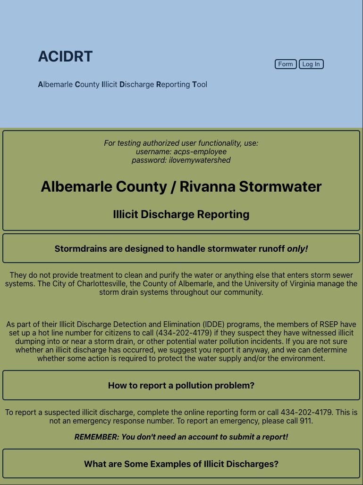
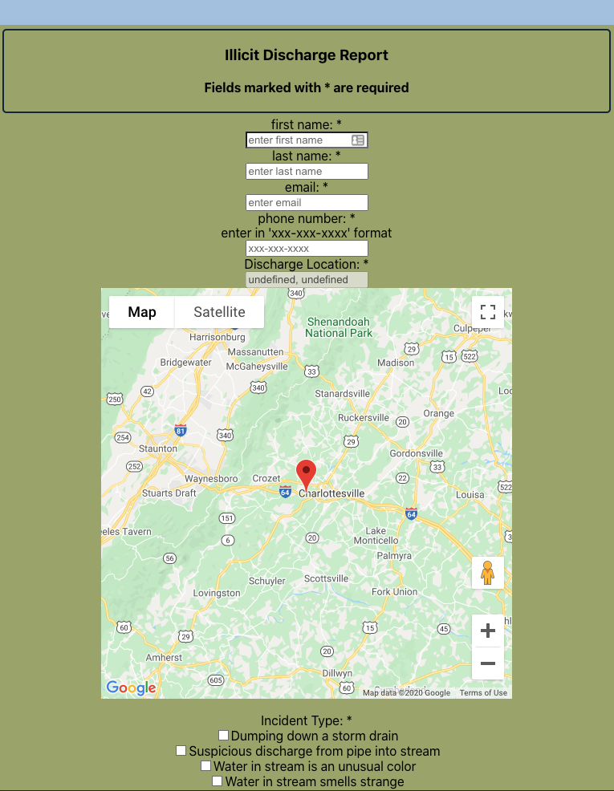
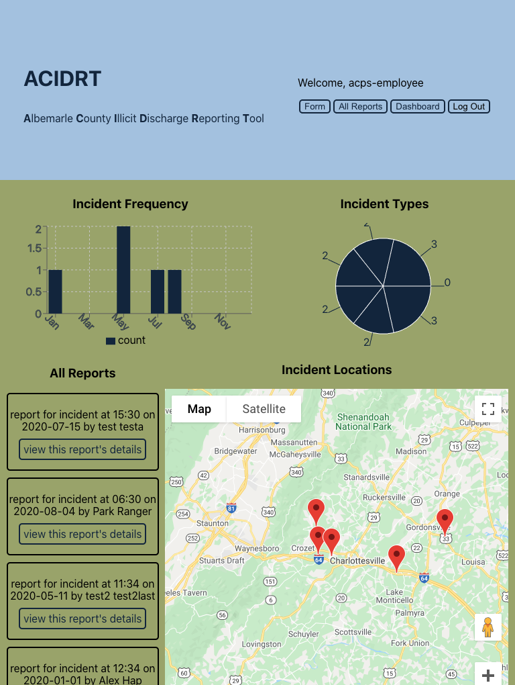
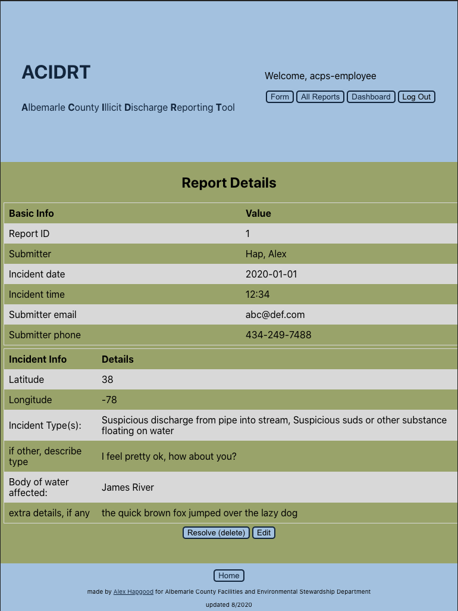

# ACIDRT

**_ACIDRT - Albemarle County Illicit Discharge Reporting Tool_**

This is a reporting tool designed for members of the public to report illicit discharge (improper disposal
of waste water). The tool also includes functionality for civil servants to access
a dashboard displaying aggregated information at a glance, as well as all the reports
submitted to that point, with the ability to edit and delete them.

- Server repo found [here](https://github.com/meta-434/acidrt-api)
- Live site found [here](https://acidrt.alex-hapgood.info/)

## Concept

The design of the tool is aimed around two user types - a member of the public intending to submit a report,
and an employee of the parks department to access the submitted reports.

Both users see the main page describing the details of illicit discharge and what constitutes a report-worthy
sighting. From here, the member of the public may access the form page, where they can input information to identify
themselves for future contact from the parks department, as well as information about the incident they wish to report,
including a map with a draggable pin to help field employees of the parks department precisely identify the incident in
question.

The employee, upon login, is presented with a dashboard providing a quick rundown of the submitted reports, incuding
a labeled pin-map of all incidents submitted, a freq/time bar chart, and an incident type breakdown chart, and the full
list of reports for easy access when conferring with the map's pin labels.

On selection of an incident, the employee is given the full details as submitted by the member of the public, as well
as the ability to update the report, and delete it, should this be the case.

## Set up

Complete the following steps to set up ACIDRT-API:

1. Clone this repository to your local machine `git clone https://github.com/meta-434/capstone-one-server.git acidrt-api`
2. `cd` into the cloned repository
3. Install the node dependencies `npm install`
4. Update the `.env` file with a `PORT`, your `SECRET_KEY` for authentication key generation, your `DATABASE_URL` for
   local sessions, an optional `REMOTE_DATABASE_URL` for production, and also optionally, a `TEST_DATABASE_URL` for local testing.
5. Run `yarn run migrate` without any parameters to create your database.
6. Run the SQL scripts in the /seeds folder on is postgreSQL to provide test data.
7. Run `yarn run dev` to start the nodemon server.

## Scripts

Start the application `yarn run dev`

Run migration SQL scripts `npm run migrate`

Run the tests `yarn run test`

## Tech

- Node.js
- Express
- PostgreSQL
- JWT
- Mocha, Chai
- Swaggerhub Inspector / Swaggerhub Editor (API Documentation)

## API Documentation

for hosted API documentation, including request / response schema,
please visit: https://app.swaggerhub.com/apis-docs/meta-434/acidrt-api/0.1

## Screenshots

main:
 

form:
 

dashboard:
 

report details:
 

